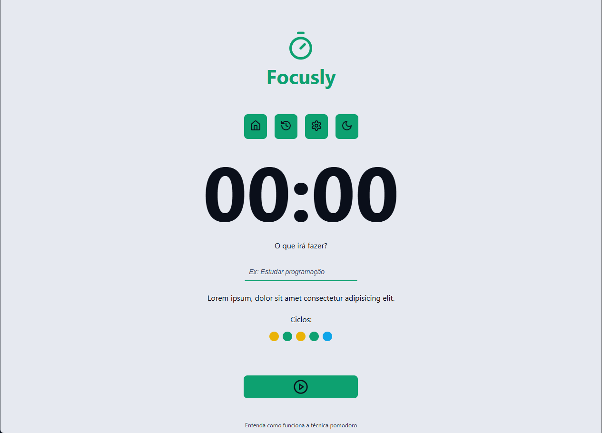

# Focusly Pomodoro App



## Descrição

Este é um projeto de um aplicativo Pomodoro desenvolvido em React. Ele ajuda a gerenciar o tempo utilizando a técnica Pomodoro, que alterna períodos de foco e descanso para aumentar a produtividade.

## Funcionalidades

- Configuração de tempos de foco e descanso.
- Interface amigável e responsiva.
- Contador visual e sonoro para alertas.

## Como Executar

1. Clone o repositório:
  ```bash
  git clone <url-do-repositorio>
  ```
2. Instale as dependências:
  ```bash
  npm install
  ```
3. Inicie o servidor de desenvolvimento:
  ```bash
  npm start
  ```

## Tecnologias Utilizadas

- React
- JavaScript
- CSS

## Link do Aplicativo

Acesse o aplicativo Focusly Pomodoro em: [https://focuslypomo.netlify.app/](https://focuslypomo.netlify.app/)

- React
- JavaScript
- CSS

## Contribuição

Contribuições são bem-vindas! Sinta-se à vontade para abrir issues ou enviar pull requests.

## Licença

Este projeto está licenciado sob a [MIT License](LICENSE).